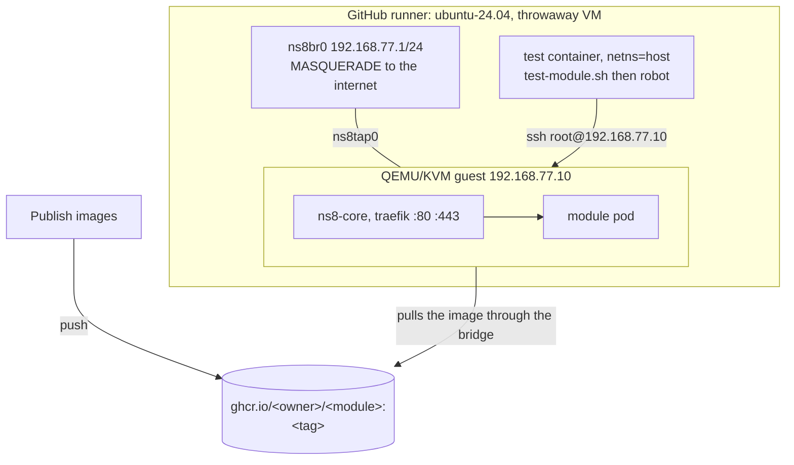

# test-on-qemu.yml

One leg: one distro, one scenario. Most modules should call
[`test-module-qemu.yml`](test-module-qemu.md) instead, which runs several of
these for you. Read this file to call a leg directly, or to look up what an
input does.

Boots a cloud image under KVM on the runner, installs the NS8 core, creates a
single-node cluster and runs the module's own test suite against it.

- [Calling it](#calling-it)
- [How it works](#how-it-works)
- [Inputs](#inputs)
- [The cloud image cache](#the-cloud-image-cache)
- [What a run produces](#what-a-run-produces)
- [When it fails](#when-it-fails)

## Calling it

Wait for the build to succeed, then test the image it published. One build, and
a broken image never reaches the test.

```yaml
on:
  workflow_run:
    workflows: ["Publish images"]
    types: [completed]

concurrency:
  # github.ref is the default branch under workflow_run, so it cannot key this.
  group: ${{ github.workflow }}-${{ github.event.workflow_run.head_branch || github.ref }}
  cancel-in-progress: true

jobs:
  module:
    if: ${{ github.event.workflow_run.conclusion == 'success' }}
    uses: NethServer/ns8-github-actions/.github/workflows/module-info.yml@v1
  test:
    needs: module
    strategy:
      fail-fast: false
      matrix:
        distro: [rocky9, debian13]
    uses: NethServer/ns8-github-actions/.github/workflows/test-on-qemu.yml@v1
    with:
      distro: ${{ matrix.distro }}
      image_url: ${{ needs.module.outputs.image }}
      repo_ref: ${{ needs.module.outputs.sha }}
      version_tag: ${{ needs.module.outputs.tag }}
      # vm_mem: 8192                   # guest memory, MiB. 12288 is the ceiling
      # disk_size: 30G                 # guest disk after resize
```

That file is the whole of it. The suite runs in a slim Python image, the cases
tagged `ui` are excluded, and nothing is posted on the pull request. See
[Interface screenshots](#interface-screenshots) to turn them on.

`script` is left out, so the module's own `test-module.sh` is used. Pass
`script: ""` instead and the shared runner of this repository takes over: the
module can then delete its copy, which is one less file drifting from the rest.

`concurrency` belongs to the caller: a reusable workflow cannot
declare one that covers the calling run.

Under `workflow_run` the default context points at the default branch, not at
the branch being tested, hence `repo_ref` and `version_tag`. Two further
consequences are inherent to that trigger and apply to the upstream DigitalOcean
workflow just the same: GitHub runs the definition from the default branch, and
the run raises no check on a pull request. A fork's publish workflow runs in the
fork, so the chain runs and reports there.

### Everything else you can set

Every input has a default. These are the ones the examples leave out, with the
value they take if you say nothing. Uncomment what you need.

Every key sits at the same indentation as `distro`, so uncommenting means
deleting the `# `: the hash **and** the space after it. Dropping only the hash
shifts the key one column and YAML rejects the file. The indented continuation
lines carry prose, not keys: delete them rather than uncomment them.

```yaml
    with:
      distro: ${{ matrix.distro }}
      # --- the guest operating system
      # cloud_image_url: ""            # a qcow2 URL, for a guest distro cannot name.
      #                                # distro: rocky9 tracks .latest, so pinning a
      #                                # point release goes here:
      #                                #   https://dl.rockylinux.org/pub/rocky/9/images/
      #                                #   x86_64/Rocky-9-GenericCloud-Base-9.8-20260525.0.x86_64.qcow2
      # --- the NS8 core
      # corebranch: ns8-stable         # git ref of ns8-core: which install.sh runs
      # install_args: ""               # what that install.sh installs: a core image,
      #                                # module URLs, or both
      # --- the module under test
      # script: test-module.sh         # test entry point in the caller repository
      # path: ""                       # subdirectory, when the module is not at the root
      # ci_actions_ref: v1             # ref this repository is read at, when script is empty
      # args: ""                       # extra arguments forwarded to robot
      # artifact_suffix: ""            # extra segment naming a leg beyond distro
      # update_from: ""                # baseline an update scenario started from, for the summary
      # --- the machine
      # runs_on: ubuntu-24.04          # must provide /dev/kvm
      # vm_mem: 8192                   # guest memory, MiB. 12288 is the ceiling
      # vm_cpus: 4                     # guest vCPUs. The runner has 4
      # disk_size: 30G                 # guest disk after resize
      # timeout_minutes: 60            # a run takes about ten
      # debug_shell: false             # tmate session when the suite fails
```

## How it works

Three environments nested inside one another. Everything else follows from that.



**The runner** is a fresh VM, destroyed when the job ends. The bridge and the
guest die with it, which is why the addresses can be hardcoded.

**The guest** is the real NS8 node. It runs under KVM inside the runner, hence
the `/dev/kvm` check: without hardware acceleration QEMU emulates, and the job
times out instead of failing.

**The test container** runs the suite. It tests nothing itself; it opens an SSH
session to the guest and runs commands there.

### The three phases

**1. Resolve the image.** `module-info` gives the reference the publish workflow
pushed, and `skopeo` resolves its digest before anything boots, so the summary
names the exact artifact under test.

**2. Bring the node up.** The cloud-init seed gives the guest its static
address and the runner's SSH key. Then, over SSH: `install.sh` from `ns8-core`, then `create-cluster`. At this
point the guest is a working single-node NS8 cluster with no module on it.

**3. Run the suite.** `test-module.sh` starts the test container and hands it
the node address and the image URL. Robot connects over SSH and drives the node:
`add-module` on the published image, then whatever the module's own suite
asserts, then `remove-module`.

## Inputs

Four things get chosen here, and they are easy to confuse because three of them
name an image. The guest operating system, the NS8 core installed on it, the
module under test, and the size of the machine.

### The guest operating system

The virtual machine the node runs on. Nothing to do with containers.

| Input | Default | |
|---|---|---|
| `distro` | `rocky9` | `rocky9`, `debian12` or `debian13`. `bookworm` and `trixie` are accepted as aliases |
| `cloud_image_url` | | a qcow2 URL, overriding the one `distro` implies. `distro` tracks `.latest`, so pinning a point release goes here: `.../Rocky-9-GenericCloud-Base-9.8-20260525.0.x86_64.qcow2`. Also how to boot an image this workflow does not name at all |

### The NS8 core

Two separate choices, and setting only the first is the usual mistake.

| Input | Default | |
|---|---|---|
| `corebranch` | `ns8-stable` | git ref of `ns8-core`, deciding **which `install.sh` is downloaded** |
| `install_args` | | arguments for that `install.sh`. A **core container image** here replaces the `ns8-stable` every `install.sh` hardcodes; anything else is treated as a module to install alongside |

Testing a development core takes both: `corebranch: 3.22.0-dev.6` alone downloads
the dev script, which then installs stable anyway.

### The module under test

| Input | Default | |
|---|---|---|
| `image_url` | **required** | the module's container image, already published and reachable from the guest. Usually `needs.module.outputs.image` |
| `repo_ref` | `github.sha` | which commit of the caller to check out, for `tests/` and the test script |
| `version_tag` | branch under test | names the artifact. `workflow_run` callers must pass it, their context points at the default branch |
| `script` | `test-module.sh` | test entry point. Empty selects `scripts/test-module.sh` of this repository, and the module ships none |
| `path` | | subdirectory holding the module, when it is not at the repository root |
| `ci_actions_ref` | `v1` | ref this repository is read at for the shared runner, when `script` is empty. Testing a branch of `ns8-github-actions` means naming it here too, since a reusable workflow is handed no context saying which ref called it |
| `args` | | extra arguments forwarded to robot, such as `-v SCENARIO:update` |
| `artifact_suffix` | | extra segment in the `test-outputs` artifact name and next to `guest` in the job summary. A caller matrixing on more than `distro` sets it, or two legs produce a same-named artifact and summaries that read identically |
| `update_from` | | baseline image an update scenario started from, shown in the job summary. Purely informational, robot still gets it through `args` |
| `run_ui_tests` | `false` | reaches the script as `RUN_UI_TESTS`, and publishes the images of `tests/outputs/` on the pull request. See [Interface screenshots](#interface-screenshots) |

### The machine

| Input | Default | |
|---|---|---|
| `runs_on` | `ubuntu-24.04` | must provide `/dev/kvm` |
| `vm_mem` | `8192` | guest memory, MiB. The runner has 15360 and uses about 1500, so 12288 is the practical ceiling |
| `vm_cpus` | `4` | guest vCPUs. The runner has 4 |
| `disk_size` | `30G` | guest disk after resize |
| `timeout_minutes` | `60` | a run takes about ten |
| `debug_shell` | `false` | tmate session when the suite fails |

## The cloud image cache

Downloading the guest image dominated the Rocky job: 93 s, 263 s then 290 s over
three runs, against 5 s for Debian, whose URL redirects to a CDN mirror. The
image is now cached, keyed on the checksum the distribution publishes next to
it.

That key does the expiry by itself. A new point release changes the checksum,
so the key changes, so the cache misses and the image is refetched. A hit is the
upstream image whatever its age, which means "too old" stops being a state the
cache can be in. GitHub deletes entries unused for 7 days and evicts by
least-recently-used past 10 GB per repository, so nothing has to be pruned by
hand. About 620 MB per distribution.

The key also carries a digest of the image URL, because `cloud_image_url` can
aim two callers with the same `distro` at different images.

The restored file is checked against that same checksum before use: a mismatch
warns, deletes the file and refetches. A fresh download that fails is retried
once against a freshly resolved checksum, because a distribution republishing into
`latest/` can leave the sum and the bytes a moment apart. It is fatal after that.

Two limits worth knowing. When no checksum is reachable beside the image the key
falls back to the calendar week and **nothing verifies the bytes**; the run
raises a warning saying so. And `actions/cache/save` cannot overwrite a key that
already exists, so an entry that fails its checksum survives until GitHub evicts
it, and every run until then refetches. Only the cache is lost: the image is
verified before it boots either way.

Two details worth knowing if you read the workflow. The save is explicit rather
than left to `actions/cache`, whose post-job step would run after the guest has
written gigabytes into the disk. And the guest boots on a copy, so the cached
base stays exactly what the checksum says.

## What a run produces

The image is tagged with the branch under test, so `add-module` in the Robot log
reads `192.168.77.1:5000/pihole:feat-8678` rather than an anonymous tag, and the
run summary names it. The artifact carries the same slug, plus `artifact_suffix`
when the caller matrixes on more than `distro`:

```
test-outputs-debian13-feat-8678
test-outputs-rocky9-feat-8678
test-outputs-rocky9-update-feat-8678
```

`diag/module-version.txt` inside it records the image URL, the digests podman
resolved on the node, and `list-installed-modules`.

## Interface screenshots

A suite can drive a browser against `cluster-admin` and save what it sees. Those
cases are tagged `ui`, and the shared runner excludes them unless
`RUN_UI_TESTS` is `true`, because they need the Playwright image rather than the
slim Python one.

`run_ui_tests` sets that variable. Once the suite is over, every image found
under `tests/outputs/` is posted as a comment on the pull request of the ref
under test:

```
### Interface of `rocky9`

**1. Status**

```

The file name becomes the caption, underscores turned into spaces, so name the
files in the order you want them read: `1._Status.png`, `2._Settings.png`.

GitHub has no public API to attach an image to a comment, so the step uses
[`cml`](https://cml.dev), which uploads the files and rewrites the Markdown
links.

### The caller, with screenshots

[`test-module-qemu.yml`](test-module-qemu.md) makes this decision for you, as
`ui_tests_strategy: on_renovate_ui_change`, and stays in sync with upstream if
that rule ever changes. Hand-roll it only for a condition it cannot express.

The same file as above, with a job deciding whether the images are worth taking
and the permission the comment needs. Screenshots read well on a dependency bump
that could have moved the interface, and are noise on every other push, so the
decision is: a `renovate-*` branch whose commit touched `ui/` or
`build-images.sh`. It is the rule `NethServer/ns8-github-actions` applies under
its `on_renovate_ui_change` strategy.

```yaml
on:
  workflow_run:
    workflows: ["Publish images"]
    types: [completed]

concurrency:
  group: ${{ github.workflow }}-${{ github.event.workflow_run.head_branch || github.ref }}
  cancel-in-progress: true

jobs:
  module:
    if: ${{ github.event.workflow_run.conclusion == 'success' }}
    uses: NethServer/ns8-github-actions/.github/workflows/module-info.yml@v1

  ui_tests:
    needs: module
    runs-on: ubuntu-latest
    outputs:
      needed: ${{ steps.decide.outputs.needed }}
    steps:
      - uses: actions/checkout@v7
        with:
          ref: ${{ needs.module.outputs.sha }}
          fetch-depth: 2
      - id: decide
        env:
          BRANCH: ${{ github.event.workflow_run.head_branch || github.ref_name }}
        run: |
          set -euo pipefail
          git diff --name-only HEAD^ HEAD | grep -qE '^ui/|^build-images.sh$' \
            && touched_ui=true || touched_ui=false
          case "${BRANCH}" in renovate-*|renovate/*) bump=true ;; *) bump=false ;; esac
          [ "${touched_ui}" = true ] && [ "${bump}" = true ] && needed=true || needed=false
          echo "needed=${needed}" >> "$GITHUB_OUTPUT"

  test:
    needs: [module, ui_tests]
    # The comment is written with the job token, and a called workflow cannot
    # hold more than its caller
    permissions:
      contents: read
      pull-requests: write
      statuses: write
    strategy:
      fail-fast: false
      matrix:
        distro: [rocky9, debian13]
    uses: NethServer/ns8-github-actions/.github/workflows/test-on-qemu.yml@v1
    with:
      distro: ${{ matrix.distro }}
      image_url: ${{ needs.module.outputs.image }}
      repo_ref: ${{ needs.module.outputs.sha }}
      version_tag: ${{ needs.module.outputs.tag }}
      # The shared runner: it already knows RUN_UI_TESTS, a module's own script might not
      script: ""
      # One leg only: every leg carrying the flag comments, so a matrix would
      # post the same images twice
      run_ui_tests: ${{ matrix.distro == 'rocky9' && needs.ui_tests.outputs.needed == 'true' }}
```

Drop the `ui_tests` job and pass `run_ui_tests: ${{ matrix.distro == 'rocky9' }}`
to capture on every run instead.

### Two traps

- **One leg only.** Each leg carrying the flag comments, so a distribution
  matrix posts the same images twice unless the caller picks one.
- **`workflow_run` reads the default branch.** A `permissions:` block added on a
  feature branch does not apply to that branch's own run; it has to land on the
  default branch first.

## The status on the pull request

Each leg sets a commit status on the tested commit, named
`continuous-integration/qemu/<distro>`, plus `-<artifact_suffix>` when given.
It is pending while the leg runs, then success or failure from the suite, or
error when the node never got as far as the suite. Under `workflow_run` this is
the only trace of the test on the pull request. It needs `statuses: write` on
the calling job, and is skipped without it.

## When it fails

The artifact holds the Robot `log.html` and `report.html`, plus a `diag/`
directory with the QEMU serial console, the guest journal, its
`/etc/os-release`, the images it pulled, listening sockets, and `podman ps` for
every module user. That is usually enough to find the cause without opening a shell.
`debug_shell: true` gives you a tmate session when it is not.
